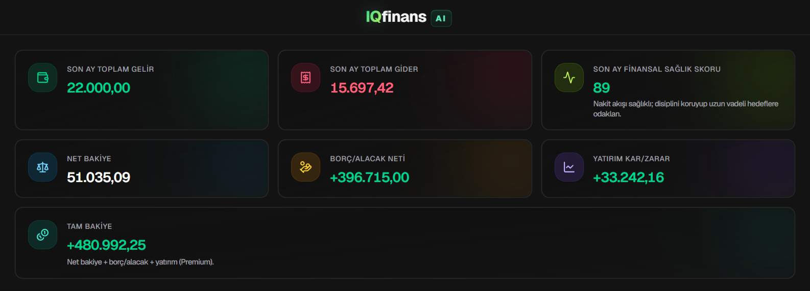

# IQfinansAI — Kişisel Finans Uygulaması

**Next.js 16 (App Router)** ile geliştirilmiş, uçtan uca tip güvenli bir kişisel finans paneli. Günlük gelir ve gider işlemlerini kategori bazında kayıt altına almanı, borçlarını alacak/verecek yönüyle ve ödeme durumlarıyla takip etmeni, altın, hisse ve benzeri yatırım pozisyonlarını maliyet ve güncel fiyatlarıyla yönetmeni sağlar. Çoklu para birimi desteği ve uygulama içi döviz kuru senkronizasyonu sayesinde TL dışındaki varlıklarını da gerçek değerleriyle görürsün; aylık bar grafikleri ve kategori dağılımı pasta grafikleriyle nakit akışını anlamlandırır, **Google Gemini** entegrasyonu ile harcama alışkanlıkların hakkında yapay zekâ destekli özetler ve öneriler alırsın.

Sunucu tarafı ağırlıklı bir mimaride **React Server Components**, **Route Handlers** ve **Server Actions** kullanılır; istemci tarafında **Redux Toolkit** ile durum yönetimi, **React Hook Form + Zod** ile tip güvenli form doğrulama yapılır. Kimlik doğrulama **NextAuth v5** üzerinden e-posta/şifre veya Google ile sağlanır. Arayüz **React 19**, **Tailwind CSS 4** ve **Radix UI** primitifleriyle erişilebilir, hızlı ve modern bir deneyim sunar; tekrarlayan ödemeler, hatırlatıcılar ve PDF/Excel dışa aktarma gibi günlük kullanımı kolaylaştıran ayrıntılarla zenginleştirilmiştir.

## Önizleme

  
   
  <em>Videoyu YouTube'da izlemek için görsele tıklayın.</em>

## Özellikler

- **Kimlik doğrulama**: E-posta/şifre ile kayıt ve giriş; isteğe bağlı Google ile oturum (NextAuth v5).
- **İşlemler**: Gelir/gider kayıtları, kategori ve tarih ile listeleme ve düzenleme.
- **Pano**: Aylık özetler, kategori dağılımı (pasta grafik) ve aylık bar grafikleri (Recharts).
- **Borçlar**: Alacak/verecek yönü, karşı taraf, ödeme durumu.
- **Yatırımlar**: Altın alt türleri, hisse vb. pozisyonlar; maliyet ve güncel fiyat alanları.
- **Döviz kurları**: Uygulama içi kur senkronizasyonu (kullanıcı para birimi ayarıyla uyumlu).
- **AI öngörüleri**: Google Gemini ile harcama/özet analizi (`GEMINI_API_KEY` gerekir).
- **Ayarlar**: Profil, para birimi, şifre güncelleme.

Veri katmanı **Prisma** ve **MySQL** ile modellenir; istemci tarafında **Redux Toolkit** ile durum yönetimi kullanılır. Arayüz **React 19**, **Tailwind CSS 4** ve **Radix UI** bileşenleriyle kurulmuştur.

## Teknolojiler

- **Framework:** Next.js 16 (App Router, Server Components, Route Handlers)
- **Dil:** TypeScript 5 (strict mode)
- **UI:** React 19, Tailwind CSS 4, Radix UI, Lucide & React Icons, Recharts
- **State:** Redux Toolkit + React Redux
- **Form & Doğrulama:** React Hook Form + Zod
- **Kimlik Doğrulama:** NextAuth v5 (Credentials + Google sağlayıcısı)
- **Veritabanı / ORM:** MySQL + Prisma 6
- **AI:** Google Gemini
- **Diğer:** date-fns, axios, pdfmake, xlsx